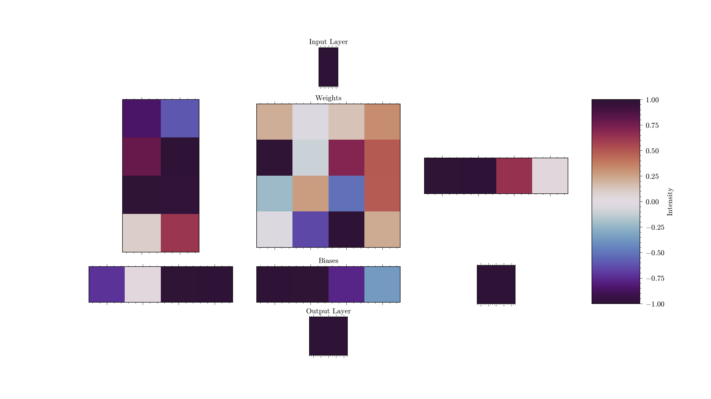
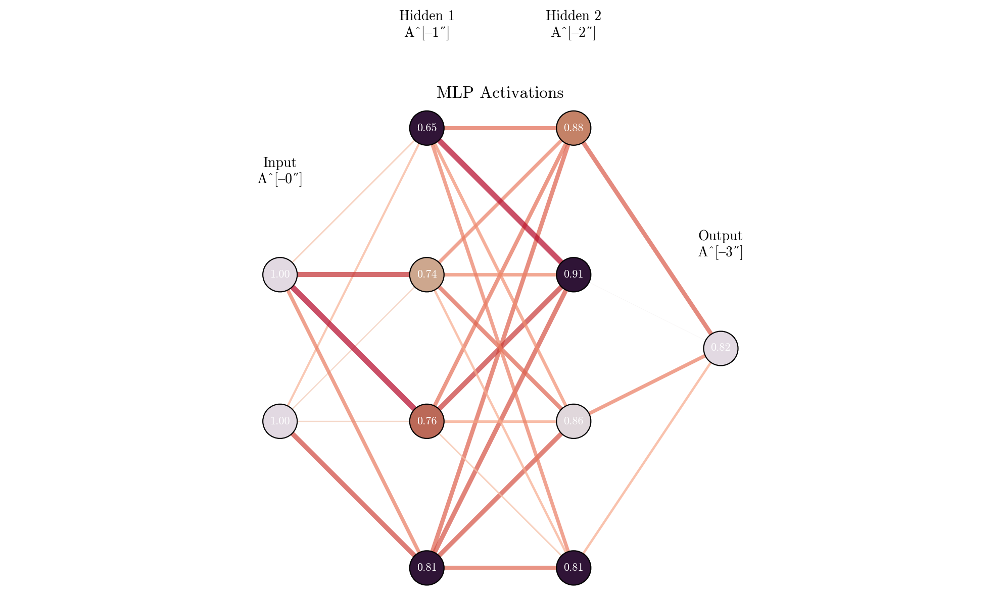

# MLP-cpp

Implement a [multilayer preceptron](https://en.wikipedia.org/wiki/Multilayer_perceptron) with C++.

Also a good excuse to build intuition on training by observing the MLP at each
training step (dump out matplotlib figures of your weights and biases and make a movie out of them!)

Start with a horribly unoptimized, working prototype and explore performance
gains through actual study and best practices. (Expand to profiling CUDA
kernels once impl gets mature enough.)
